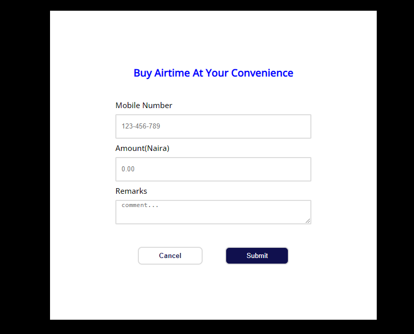
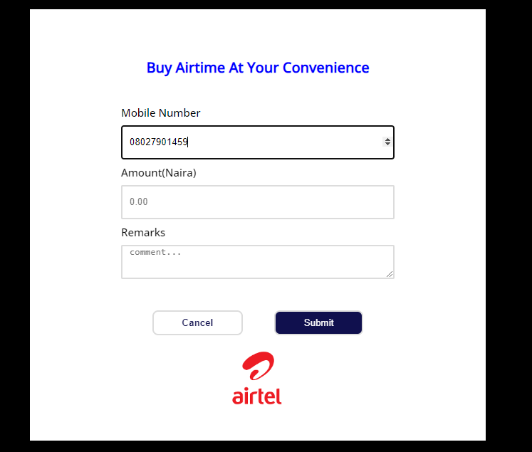

# TechHub Group Challenge - Team 5 Project Phonie

### What
Solidify what you’ve learnt by building cool simple things you can showcase

### Why
Practice makes perfect. We’re getting you ready for all the fun projects in the coming semester

### How
*   Build the below project as a group / team, using Repl.it 
*   Vanilla HTML/CSS and Javascript is sufficient to build these projects as fully functional apps, so don’t use any fancy libraries or frameworks. Doing so can cost you some points!
*   It’s a healthy competition amongst teams, so try your best to make your application functional, clean and presentable

## Table of contents

- [Overview](#overview)
  - [The challenge](#the-challenge)
  - [Scenario](#scenario)
  - [Outcome](#outcome)
  - [Advanced Features](#advanced-features)
  - [Screenshot](#screenshot)
  - [Links](#links)
  - [Built with](#built-with)
  - [What was learnt](#what-was-learnt)
  - [Continued development](#continued-development)
  - [Useful resources](#useful-resources)
- [Contributors](#contributors)
- [Acknowledgments](#acknowledgments)

## Overview

### The challenge - Phonie: Identify the telecoms carrier from a phone number

#### Scenario

A user is filling a form in your web application and they are required to enter their phone number into a form field.

#### Outcome
After typing the phone number into the form field, the UI indicates that it is an MTN or GLO or Airtel or Etisalat number e.t.c (e.g if its an MTN line, display the MTN icon/logo somewhere beside the form field).

#### Advanced features (OPTIONAL- build any, some or all of the following if you feel up to it) 

* Add validation - Use the `pattern` attribute of the HTML form field to restrict phone numbers to a certain carrier, e.g restrict to only Airtel such that entering an MTN/GLO number would be invalid
* Support +XYZ country codes (e.g +234 for Nigeria) - Still detect the carrier even if the user prefixed the number with their +XYZ country code
* Show auto-completion - Show suggestions as the user starts typing the phone number. E.g once they type 080, show them that 080*3* and 080*6* and other possible *matching* variants of the carrier

**_N.B: The advanced features were not implemented in this project._**

### Screenshot

### Links

- Solution URL: [Click here for solution URL](https://github.com/mchenryspagg/team-5-phonie)
- Live Site URL: [Click here for live site URL](https://mchenryspagg.github.io/team-5-phonie/)

### Built with

- HTML5 markup
- CSS
- Javascript

### What was learnt

The knowledge on how to collaborate in a team project is the first lesson learnt. Also, harnessing the strengths of every team members whilst overlooking the inherent weaknesses of others. Improvement in the knowledge and application of writing Javascript codes to solve programming problems.

### Continued development

More projects would be completed both as a team and as individuals. 

### Useful resources

- [The Complete Javascript course 2022 - From Zero to Hero](https://www.udemy.com/course/the-complete-javascript-course/) - This course is great to learn and master javascript with practical hands-on experience to test your learning as you go
- [Freecodecamp's Responsive Web Design](https://www.freecodecamp.org/learn/responsive-web-design/) - This is an amazing website and also a wonderful resource to learn web design. I learnt quite a lot from freecodecamp as a beginner. 

## Contributors

1. Henry Ugochukwu Okam - [Email](mailto:hnry_ugo@yahoo.com) | twitter - [@mchenryspagg](https://www.twitter.com/mchenryspagg)
2. Muhammed Ibrahim - [Email](mailto:omoyaniger1@gmail.com)
3. Kushimo Oyindamola - [Email](mailto:kushimo.oyindamola@gmail.com)
4. Alice Eneyo - [Email](mailto:aliceeneyo@gmail.com)
5. Umeh Cassandra - [Email](mailto:umehcassandra@gmail.com)
6. Zainab Aderimo - [Email](mailto:zainabaderinmola@gmail.com)
7. Sarah Aligbe - [Email](mailto:sarahligbe12@gmail.com)
8. Christiana - [Email](mailto:christianahadekanye@gmail.com)
9. Omoruyi Osakue Emmanuel - [Email](mailto:osakueomoruyi@gmail.com)

## Acknowledgments
Special thanks to all the team members that contributed immeasurably to bring about the completion of this project. Special shoutout to AltschoolAfrica for the project brief, and also a special shoutout to the Tech Hub Slack community comprising of young passionate tech newbies and intermediate professionals striving to become worldclass software engineers through collaboration, knowledge sharing and motivating one another.

